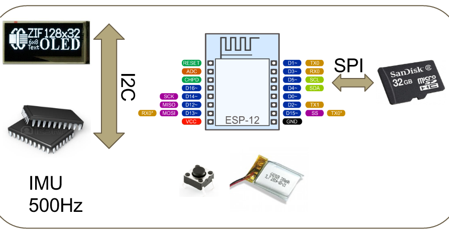

PROJECT NAME
============

**University of Pennsylvania, ESE 519: Real Time and Embedded Systems**

* Tianyang Chen
* Rishab Gupta
* Namneet Kaur
* [Blog]https://devpost.com/software/rocket-pitch

### DESCRIPTION AND GOALS
Teenager baseball player tend to suffer from albow and arm injures from pitching too many times in consecutive days. Many young players terminated their career due to injures. Many research has recommanded some rest days in between plays for couches as well as parents to protect their kids.

This is the repo for the Baseball pitch detection project for teenager players.
The goal of this device is to accurately detect pitch events and give an estimated speed to a user wearing the device. The raw data is logged onto the SD card for future research and algorithm tuning.

The data logged include accelerometer and gyroscope in all three axis. The logging rate is around 537 Hz. Every half a second, the buffered data will be flushed to the SD card to ensure data persistency.

### VIDEO

### IMAGES and GIFs
Add images and screenshot of your product, user iterface, etc. Animated GIFs of User interfaces would be preferred.

### BUILD INSTRUCTIONS
The project is using ESP8266 miro-controller, Adafruit 9dof IMU, Adafruit OLED, micro-SD card.
Clone the repo and import the library folders to Arduino. Download the wifi manager library for ESP8266. The modified libraries have extra low level functions that are not available in the original adafruit libraries. 

